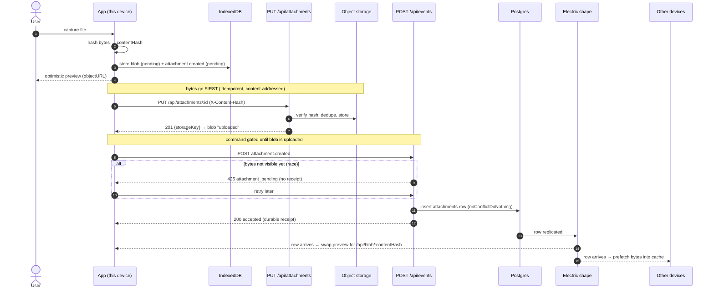

# Sync Design

This document describes a generic offline-first sync engine built around append-only client events, idempotent server processing, durable local queuing, and explicit handling for flaky or half-open network conditions. The design is intentionally generic: the transport and sync engine do not know about specific entities such as todos, orders, or devices, and the backend delegates acceptance or rejection to pluggable event handlers.[cite:31][cite:34][cite:64][cite:69]

## Design intent

The engine is designed for systems where the client must continue to work while offline or under poor connectivity, then synchronize safely when a connection becomes available again. The hard problems are not only persistence and retry, but also ambiguous outcomes, duplicates, stale writes, and recovery after transport failures.[cite:31][cite:34][cite:64][cite:75]

The design therefore combines several patterns that work together:

- Local durable queue on the client.[cite:31][cite:42][cite:46]
- Stable event identity and idempotent replay.[cite:83][cite:86][cite:88]
- Inbox-style dedupe and durable decision receipts on the server.[cite:56][cite:60][cite:61]
- Timeouts, exponential backoff, and circuit breaking for partial or failing networks.[cite:70][cite:71][cite:75][cite:111]
- Explicit handling of ambiguous transport outcomes using status probes by event identity.[cite:34][cite:75][cite:83]

## Core principles

### Local-first writes

A user action must be accepted locally before the network succeeds. Otherwise, bad connectivity turns into a broken UX and risks data loss if the process exits before the request completes.[cite:31][cite:42][cite:46]

### At-least-once transport, effectively-once processing

Networks and retries naturally produce duplicates. The sync engine should assume at-least-once delivery and make processing idempotent, rather than assuming a request is delivered exactly once.[cite:56][cite:60][cite:75][cite:83]

### Explicit ambiguity

A timeout does not mean failure. In weak Wi‑Fi or unstable mobile links, the server may have committed the event while the response was lost. The client therefore needs an `unknown` state and a way to reconcile later instead of assuming the event failed.[cite:34][cite:75][cite:83]

### Generic transport layer

The sync engine transports generic event envelopes. Domain logic is implemented by server-side handlers that either accept or reject the event. This keeps the sync mechanism reusable across different business domains.[cite:56][cite:61][cite:69]

## Event model

The client syncs a generic event envelope rather than entity-specific mutations.[cite:69][cite:83]

```ts
// shared/event-types.ts
export type EventEnvelope = {
  eventId: string;
  idempotencyKey: string;
  streamId: string;
  streamType: string;
  eventType: string;
  clientId: string;
  deviceId?: string | null;
  baseVersion?: number | null;
  issuedAt: string;
  payload: Record<string, unknown>;
  meta?: Record<string, unknown>;
};
```

### Why `eventId`

`eventId` is the stable identity of the event itself. It lets the system ask, “have you seen and processed this exact event before?” and it supports receipt lookups after ambiguous transport failures.[cite:85][cite:89][cite:98]

### Why `idempotencyKey`

`idempotencyKey` identifies the submission intent and ensures retries of the same send operation are treated as the same logical request. It is best treated as a stable operation identifier, not as a payload checksum.[cite:96][cite:99][cite:102]

### Why not use only one field

In simple systems, `eventId` and `idempotencyKey` may be identical. They are kept conceptually separate because event identity and transport retry identity solve different problems, and separating them leaves room for later evolution without changing the model.[cite:85][cite:89][cite:96]

## Client architecture

The client has four main responsibilities:

- store events durably,
- apply local optimistic updates,
- flush queued events when possible,
- and reconcile uncertain outcomes.[cite:31][cite:42][cite:46][cite:74]

### Local event store

The local queue should live in durable browser storage such as IndexedDB. The queue must survive refreshes, crashes, backgrounding, and temporary connectivity loss.[cite:42][cite:45][cite:46]

```ts
// client/src/engine/db.ts
import Dexie, { type Table } from 'dexie';

export type LocalEventRecord = {
  eventId: string;
  idempotencyKey: string;
  streamId: string;
  streamType: string;
  eventType: string;
  clientId: string;
  deviceId?: string | null;
  baseVersion?: number | null;
  issuedAt: string;
  payload: Record<string, unknown>;
  meta?: Record<string, unknown>;
  syncState:
    | 'pending'
    | 'sending'
    | 'accepted'
    | 'rejected'
    | 'unknown'
    | 'retry_wait'
    | 'conflict'
    | 'dead_letter';
  attempts: number;
  nextAttemptAt: string | null;
  leaseOwner: string | null;
  leaseExpiresAt: string | null;
  lastAttemptAt: string | null;
  lastErrorCode: string | null;
  lastErrorMessage: string | null;
  lastHttpStatus: number | null;
  remoteReceipt?: {
    decision: 'accepted' | 'rejected';
    processedAt: string;
    serverEventId: string;
    serverVersion?: number | null;
    reason?: string | null;
    code?: string | null;
  } | null;
};

class EngineDb extends Dexie {
  events!: Table<LocalEventRecord, string>;

  constructor() {
    super('generic-eventstore-sync');
    this.version(1).stores({
      events: 'eventId, syncState, streamType, streamId, issuedAt, nextAttemptAt',
    });
  }
}

export const appDb = new EngineDb();
```

### Why leasing is needed

Lease fields such as `leaseOwner` and `leaseExpiresAt` prevent multiple tabs, workers, or overlapping loops from processing the same pending event at the same time. Without leasing, concurrent flushers can cause duplicate sends and confusing local state transitions even if the server-side dedupe remains correct.[cite:34][cite:46]

`leaseOwner` holds a `SYNC_INSTANCE_ID` — a UUID minted once per execution context (tab or worker) at module load, so each context is a distinct owner. Lease expiry handles contention between *live* instances, but it does not by itself recover a record that a crash or app recycle left mid-flight in `sending`/`uploading`: those states are not re-selected by the flush query. See [Recovery after recycle or restart](#recovery-after-recycle-or-restart).[cite:34]

### Client event lifecycle

The client should treat sync as a state machine instead of a boolean “synced/unsynced” model.[cite:34][cite:74]

| State | Meaning | Why it exists |
|---|---|---|
| `pending` | Ready to send | Standard queued state.[cite:31][cite:46] |
| `sending` | Currently in flight | Prevents duplicate local workers sending the same event.[cite:34] |
| `accepted` | Server accepted the event | Final success state.[cite:56][cite:61] |
| `rejected` | Server rejected the event | Final failure with business meaning.[cite:56][cite:61] |
| `unknown` | Outcome ambiguous | Needed after timeout or broken response.[cite:34][cite:75] |
| `retry_wait` | Waiting for backoff window | Prevents hot-loop retries.[cite:70][cite:75] |
| `conflict` | Requires merge or user/system policy | Useful when handler rejects due to optimistic concurrency.[cite:31][cite:34] |
| `dead_letter` | Give up automated retry | Needed for poisoned or invalid events.[cite:34] |

This explicit state model is critical. Systems that treat sync as only “it worked” or “it failed” cannot represent ambiguous transport outcomes correctly and tend to create retry storms or silent duplication.[cite:34][cite:75]

## Client event creation

When the application produces a new event, it should:

1. create the event envelope,
2. store it durably,
3. apply any local optimistic state update,
4. schedule a background flush.[cite:31][cite:42][cite:46]

```ts
// client/src/engine/createEvent.ts
export function createEvent(input: {
  streamId: string;
  streamType: string;
  eventType: string;
  clientId: string;
  deviceId?: string | null;
  baseVersion?: number | null;
  payload: Record<string, unknown>;
  meta?: Record<string, unknown>;
}) {
  const eventId = crypto.randomUUID();
  const idempotencyKey = eventId;

  return {
    eventId,
    idempotencyKey,
    streamId: input.streamId,
    streamType: input.streamType,
    eventType: input.eventType,
    clientId: input.clientId,
    deviceId: input.deviceId ?? null,
    baseVersion: input.baseVersion ?? null,
    issuedAt: new Date().toISOString(),
    payload: input.payload,
    meta: input.meta ?? {},
  };
}
```

Using the same stable identifiers across retries is essential. Regenerating them on each retry turns duplicate delivery into distinct operations and defeats idempotency.[cite:83][cite:88][cite:102]

## Network resilience patterns

Offline-first sync does not just need retries; it needs disciplined retries.[cite:70][cite:75][cite:111]

### Timeouts

Every request needs a hard timeout. Without timeouts, weak links can hang indefinitely and block a queue worker or tie up the UI with operations that never return.[cite:74][cite:75][cite:111]

### Backoff and jitter

Retries should use exponential backoff with jitter. Backoff prevents rapid retry loops; jitter prevents many clients from retrying in lockstep when a service or network recovers.[cite:70][cite:77][cite:82]

### Circuit breaker

A circuit breaker stops sending events after repeated failures and later allows a cautious probe. This protects the client, the network path, and the server from retry storms and cascading degradation.[cite:71][cite:111][cite:115][cite:118]

Closed means normal traffic, open means fail fast without attempting the transport, and half-open means allow one or a few probe requests to test recovery.[cite:111][cite:115][cite:118]

### Unknown state and status probing

If a timeout or truncated response happens, the client must not assume the event failed. Instead, it marks the event `unknown` and later asks the server for the authoritative status by `eventId`.[cite:34][cite:75][cite:83]

This pattern is one of the most important parts of robust sync. It is what prevents a half-connection from turning into duplicate side effects.[cite:34][cite:75]

## Client transport implementation

The following code shows a resilient transport wrapper with timeout, retry, and circuit breaker behavior.[cite:70][cite:71][cite:75][cite:111]

```ts
// client/src/engine/network.ts
export class TimeoutError extends Error {
  constructor(message = 'request_timeout') {
    super(message);
    this.name = 'TimeoutError';
  }
}

export class CircuitOpenError extends Error {
  constructor(message = 'circuit_open') {
    super(message);
    this.name = 'CircuitOpenError';
  }
}

type CircuitState = 'closed' | 'open' | 'half_open';

const circuit = {
  state: 'closed' as CircuitState,
  failures: 0,
  openedAt: 0,
  failureThreshold: 5,
  recoveryMs: 30_000,
  allowProbe: true,
};

function nowMs() {
  return Date.now();
}

function beforeRequest() {
  if (circuit.state === 'open') {
    if (nowMs() - circuit.openedAt > circuit.recoveryMs) {
      circuit.state = 'half_open';
      circuit.allowProbe = true;
    } else {
      throw new CircuitOpenError();
    }
  }

  if (circuit.state === 'half_open') {
    if (!circuit.allowProbe) throw new CircuitOpenError();
    circuit.allowProbe = false;
  }
}

function onSuccess() {
  circuit.state = 'closed';
  circuit.failures = 0;
  circuit.allowProbe = true;
}

function onFailure() {
  circuit.failures += 1;
  if (circuit.failures >= circuit.failureThreshold) {
    circuit.state = 'open';
    circuit.openedAt = nowMs();
    circuit.allowProbe = true;
  } else if (circuit.state === 'half_open') {
    circuit.state = 'open';
    circuit.openedAt = nowMs();
    circuit.allowProbe = true;
  }
}

function sleep(ms: number) {
  return new Promise((resolve) => setTimeout(resolve, ms));
}

function backoffDelay(attempt: number, base = 800, cap = 30_000) {
  const raw = Math.min(cap, base * 2 ** attempt);
  const jitter = Math.floor(raw * (0.2 + Math.random() * 0.4));
  return raw + jitter;
}

function isRetryableStatus(status: number) {
  return status === 408 || status === 425 || status === 429 || status >= 500;
}

export async function resilientFetch(
  input: RequestInfo | URL,
  init: RequestInit & { timeoutMs?: number; maxRetries?: number } = {}
) {
  const timeoutMs = init.timeoutMs ?? 8_000;
  const maxRetries = init.maxRetries ?? 2;

  let attempt = 0;
  let lastError: unknown;

  while (attempt <= maxRetries) {
    try {
      beforeRequest();

      const controller = new AbortController();
      const timer = setTimeout(() => controller.abort(), timeoutMs);

      const res = await fetch(input, {
        ...init,
        signal: controller.signal,
      }).catch((err) => {
        if ((err as Error).name === 'AbortError') throw new TimeoutError();
        throw err;
      });

      clearTimeout(timer);

      if (isRetryableStatus(res.status)) {
        onFailure();
        if (attempt === maxRetries) return res;
        await sleep(backoffDelay(attempt));
        attempt += 1;
        continue;
      }

      onSuccess();
      return res;
    } catch (err) {
      lastError = err;
      onFailure();

      if (attempt === maxRetries) throw err;
      await sleep(backoffDelay(attempt));
      attempt += 1;
    }
  }

  throw lastError instanceof Error ? lastError : new Error('network_failure');
}
```

## Queue flushing and ambiguous outcome handling

The queue worker sends eligible events, updates local state, and probes the server after ambiguous failures.[cite:34][cite:75][cite:83]

```ts
// client/src/engine/sync.ts
import { appDb } from './db';
import { resilientFetch, TimeoutError, CircuitOpenError } from './network';

const SYNC_INSTANCE_ID = crypto.randomUUID(); // one per tab / worker, regenerated on reload
const LEASE_MS = 20_000;

function isoNow() {
  return new Date().toISOString();
}

function futureIso(ms: number) {
  return new Date(Date.now() + ms).toISOString();
}

function classifyTransportError(err: unknown) {
  if (err instanceof CircuitOpenError) return { code: 'circuit_open', retry: true, unknown: false };
  if (err instanceof TimeoutError) return { code: 'timeout', retry: true, unknown: true };
  if (err instanceof TypeError) return { code: 'network_type_error', retry: true, unknown: true };
  return { code: 'unknown_transport', retry: true, unknown: true };
}

async function tryResolveUnknown(eventId: string) {
  try {
    const res = await resilientFetch(`/api/events/${eventId}/status`, {
      method: 'GET',
      timeoutMs: 5_000,
      maxRetries: 0,
    });

    if (res.status === 404) return { known: false } as const;

    const data = await res.json();
    return { known: true, data } as const;
  } catch {
    return { known: null } as const;
  }
}

export async function flushEventQueue() {
  const candidates = await appDb.events
    .where('syncState')
    .anyOf('pending', 'retry_wait', 'unknown')
    .toArray();

  candidates.sort((a, b) => a.issuedAt.localeCompare(b.issuedAt));

  for (const event of candidates) {
    if (event.nextAttemptAt && event.nextAttemptAt > isoNow()) continue;

    const activeLease =
      event.leaseExpiresAt && new Date(event.leaseExpiresAt).getTime() > Date.now();

    if (activeLease && event.leaseOwner !== SYNC_INSTANCE_ID) continue;

    await appDb.events.update(event.eventId, {
      syncState: 'sending',
      leaseOwner: SYNC_INSTANCE_ID,
      leaseExpiresAt: futureIso(LEASE_MS),
      lastAttemptAt: isoNow(),
      lastErrorCode: null,
      lastErrorMessage: null,
    });

    try {
      const res = await resilientFetch('/api/events', {
        method: 'POST',
        headers: {
          'Content-Type': 'application/json',
          'Idempotency-Key': event.idempotencyKey,
          'X-Event-Id': event.eventId,
        },
        body: JSON.stringify(event),
        timeoutMs: 8_000,
        maxRetries: 1,
      });

      const text = await res.text();
      let data: any = null;

      try {
        data = text ? JSON.parse(text) : null;
      } catch {
        await appDb.events.update(event.eventId, {
          syncState: 'unknown',
          leaseOwner: null,
          leaseExpiresAt: null,
          lastErrorCode: 'malformed_response',
          lastErrorMessage: 'response_not_parseable',
          nextAttemptAt: futureIso(5_000),
        });
        continue;
      }

      if (res.ok && data?.decision === 'accepted') {
        await appDb.events.update(event.eventId, {
          syncState: 'accepted',
          leaseOwner: null,
          leaseExpiresAt: null,
          lastHttpStatus: res.status,
          remoteReceipt: {
            decision: 'accepted',
            processedAt: data.processedAt,
            serverEventId: data.serverEventId,
            serverVersion: data.serverVersion ?? null,
            reason: null,
            code: null,
          },
        });
        continue;
      }

      if (res.status === 409 && data?.decision === 'rejected') {
        await appDb.events.update(event.eventId, {
          syncState: data.code === 'version_conflict' ? 'conflict' : 'rejected',
          leaseOwner: null,
          leaseExpiresAt: null,
          lastHttpStatus: res.status,
          remoteReceipt: {
            decision: 'rejected',
            processedAt: data.processedAt,
            serverEventId: data.serverEventId,
            serverVersion: data.serverVersion ?? null,
            reason: data.reason ?? null,
            code: data.code ?? null,
          },
        });
        continue;
      }

      if (res.status === 400) {
        await appDb.events.update(event.eventId, {
          syncState: 'dead_letter',
          leaseOwner: null,
          leaseExpiresAt: null,
          lastHttpStatus: res.status,
          lastErrorCode: 'invalid_event',
          lastErrorMessage: typeof data?.error === 'string' ? data.error : 'invalid_event',
        });
        continue;
      }

      await appDb.events.update(event.eventId, {
        syncState: 'retry_wait',
        leaseOwner: null,
        leaseExpiresAt: null,
        lastHttpStatus: res.status,
        lastErrorCode: 'retryable_http',
        lastErrorMessage: `http_${res.status}`,
        attempts: event.attempts + 1,
        nextAttemptAt: futureIso(Math.min(60_000, 1000 * 2 ** Math.max(1, event.attempts))),
      });
    } catch (err) {
      const classified = classifyTransportError(err);

      if (classified.unknown) {
        const probe = await tryResolveUnknown(event.eventId);

        if (probe.known === true && probe.data?.decision === 'accepted') {
          await appDb.events.update(event.eventId, {
            syncState: 'accepted',
            leaseOwner: null,
            leaseExpiresAt: null,
            remoteReceipt: {
              decision: 'accepted',
              processedAt: probe.data.processedAt,
              serverEventId: probe.data.serverEventId,
              serverVersion: probe.data.serverVersion ?? null,
              reason: null,
              code: null,
            },
          });
          continue;
        }

        if (probe.known === true && probe.data?.decision === 'rejected') {
          await appDb.events.update(event.eventId, {
            syncState: probe.data.code === 'version_conflict' ? 'conflict' : 'rejected',
            leaseOwner: null,
            leaseExpiresAt: null,
            remoteReceipt: {
              decision: 'rejected',
              processedAt: probe.data.processedAt,
              serverEventId: probe.data.serverEventId,
              serverVersion: probe.data.serverVersion ?? null,
              reason: probe.data.reason ?? null,
              code: probe.data.code ?? null,
            },
          });
          continue;
        }

        await appDb.events.update(event.eventId, {
          syncState: 'unknown',
          leaseOwner: null,
          leaseExpiresAt: null,
          attempts: event.attempts + 1,
          lastErrorCode: classified.code,
          lastErrorMessage: err instanceof Error ? err.message : classified.code,
          nextAttemptAt: futureIso(Math.min(60_000, 1500 * 2 ** Math.max(1, event.attempts))),
        });
        continue;
      }

      await appDb.events.update(event.eventId, {
        syncState: 'retry_wait',
        leaseOwner: null,
        leaseExpiresAt: null,
        attempts: event.attempts + 1,
        lastErrorCode: classified.code,
        lastErrorMessage: err instanceof Error ? err.message : classified.code,
        nextAttemptAt: futureIso(Math.min(60_000, 1500 * 2 ** Math.max(1, event.attempts))),
      });
    }
  }
}
```

## Recovery after recycle or restart

A client can be recycled at any moment — a browser reload, a killed and relaunched process, a mobile WebView torn down in the background, or a crashed tab. Durable data survives (the queue and blobs live in IndexedDB), but two things need care after a recycle.[cite:42][cite:46]

First, `SYNC_INSTANCE_ID` is regenerated on load, so the relaunched app is a *different* lease owner than the instance that died. Any record the dead instance was processing still carries its `leaseOwner` and a possibly-unexpired `leaseExpiresAt`.[cite:34]

Second, and more importantly, a record caught **mid-flight** is frozen in a transient state — a command in `sending`, a blob in `uploading`. The flush query only re-selects `pending`, `retry_wait`, and `unknown`, so an in-flight record is **not** picked up again on its own. Lease expiry alone does not rescue it, because expiry only governs *eligibility among live owners*, not re-selection of a stuck state. Without a recovery step, such a record is stranded forever.[cite:34][cite:75]

The fix is a startup sweep that runs once before the normal flush loop. It requeues in-flight records whose lease has expired — so it never steals work from a still-live sibling tab — and moves them to `unknown` rather than `pending`.[cite:34][cite:75][cite:83]

```ts
// client/src/engine/recover.ts — run once on app start, before flushing
export async function recoverInFlight() {
  const now = isoNow();

  const stuckEvents = await appDb.events.where('syncState').equals('sending').toArray();
  for (const e of stuckEvents) {
    if (e.leaseExpiresAt && e.leaseExpiresAt > now) continue; // a live tab may still own it
    await appDb.events.update(e.eventId, {
      syncState: 'unknown',          // outcome is genuinely ambiguous — probe, don't blind-resend
      leaseOwner: null,
      leaseExpiresAt: null,
      nextAttemptAt: null,
    });
  }

  const stuckBlobs = await appDb.attachments.where('uploadState').equals('uploading').toArray();
  for (const a of stuckBlobs) {
    if (a.leaseExpiresAt && a.leaseExpiresAt > now) continue;
    await appDb.attachments.update(a.attachmentId, {
      uploadState: 'unknown',        // probe /status before re-PUTting a large blob
      leaseOwner: null,
      leaseExpiresAt: null,
      nextAttemptAt: null,
    });
  }
}
```

Recovering to `unknown` — not `pending` — is the important detail. When the app died mid-send, whether the server received the request is genuinely unknown, which is exactly what the `unknown` state models. Routing the record there makes the flush loop **probe `/status` first** (`/api/events/:eventId/status`, `/api/attachments/:id/status`) instead of blindly re-sending, which avoids a redundant multi-megabyte re-upload and a duplicate side effect.[cite:34][cite:75][cite:83] Even in the worst case a re-send is safe, because the server's inbox and `contentHash` dedupe make replays idempotent — so recovery can never corrupt state, it only decides how efficiently the record is resolved.[cite:56][cite:60][cite:83]

The lease `leaseExpiresAt > now` guard means a record recycled within the last `LEASE_MS` waits out the remainder of its lease before recovery reclaims it. This bounded stall is deliberate: it is the same rule that stops one live tab from stealing another live tab's in-flight record, since neither can tell a crashed owner from a slow one by id alone.[cite:34][cite:46]

## Server architecture

The server side has three responsibilities:

- receive and validate events,
- dedupe and persist them safely,
- pass them to a generic handler that accepts or rejects the event.[cite:56][cite:60][cite:61]

### Storage model

The server stores several kinds of data with different responsibilities.

| Table | Responsibility |
|---|---|
| `inbound_events` | Durable inbox of received events and event metadata. |
| `event_decisions` | Durable final receipt for accept/reject outcome. |
| `event_processing_log` | Operational lifecycle log for tracing and debugging. |

This separation is useful because dedupe, authoritative outcome, and support telemetry have different retention and query patterns.[cite:123][cite:135][cite:148]

### Why an inbox table is needed

The inbox pattern lets the server recognize duplicates and replayed requests safely in at-least-once delivery systems. It is the server-side counterpart to client retries and idempotency keys.[cite:56][cite:60][cite:61]

### Why a decision table is needed

The decision table is the durable receipt store. It lets the server return the same final answer for duplicate deliveries and lets the client probe event status after ambiguous failures.[cite:34][cite:61][cite:83]

### Why a processing log is useful

`event_processing_log` is not strictly required for minimal idempotency, but it is valuable for support, observability, and forensics. It shows where an event was in the pipeline when a failure occurred and helps diagnose cases where no final decision was recorded.[cite:123][cite:124][cite:135]

## Drizzle schema

```ts
// server/src/db/schema.ts
import {
  pgTable,
  uuid,
  text,
  timestamp,
  jsonb,
  uniqueIndex,
  index,
  integer,
} from 'drizzle-orm/pg-core';

export const inboundEvents = pgTable(
  'inbound_events',
  {
    eventId: uuid('event_id').primaryKey(),
    idempotencyKey: text('idempotency_key').notNull(),
    streamId: text('stream_id').notNull(),
    streamType: text('stream_type').notNull(),
    eventType: text('event_type').notNull(),
    clientId: text('client_id').notNull(),
    deviceId: text('device_id'),
    baseVersion: integer('base_version'),
    issuedAt: timestamp('issued_at', { withTimezone: true }).notNull(),
    payload: jsonb('payload').notNull(),
    meta: jsonb('meta').notNull().default({}),
    receiveState: text('receive_state').notNull(),
    createdAt: timestamp('created_at', { withTimezone: true }).notNull(),
    updatedAt: timestamp('updated_at', { withTimezone: true }).notNull(),
  },
  (t) => ({
    uniqIdempotency: uniqueIndex('inbound_events_idempotency_idx').on(t.idempotencyKey),
    byStream: index('inbound_events_stream_idx').on(t.streamType, t.streamId, t.issuedAt),
    byClient: index('inbound_events_client_idx').on(t.clientId, t.issuedAt),
  })
);

export const eventDecisions = pgTable('event_decisions', {
  eventId: uuid('event_id').primaryKey(),
  decision: text('decision').notNull(),
  code: text('code'),
  reason: text('reason'),
  serverEventId: uuid('server_event_id').notNull(),
  serverVersion: integer('server_version'),
  result: jsonb('result').notNull(),
  processedAt: timestamp('processed_at', { withTimezone: true }).notNull(),
});

export const eventProcessingLog = pgTable('event_processing_log', {
  id: uuid('id').primaryKey(),
  eventId: uuid('event_id').notNull(),
  stage: text('stage').notNull(),
  data: jsonb('data').notNull(),
  createdAt: timestamp('created_at', { withTimezone: true }).notNull(),
});
```

## Generic handler contract

The transport layer should delegate domain policy to a generic handler contract.[cite:56][cite:61]

```ts
// server/src/engine/types.ts
import type { EventEnvelope } from '../../shared/event-types';

export type HandlerDecision =
  | {
      decision: 'accepted';
      serverVersion?: number | null;
      result?: Record<string, unknown>;
    }
  | {
      decision: 'rejected';
      code: string;
      reason: string;
      result?: Record<string, unknown>;
    };

export type EventHandlerContext = {
  now: Date;
  signal?: AbortSignal;
};

export type EventHandler = (
  event: EventEnvelope,
  ctx: EventHandlerContext
) => Promise<HandlerDecision>;
```

This is where aggregate validation, permissions, concurrency rules, business rejection, and downstream writes belong. The sync engine should not hard-code those concerns.[cite:56][cite:61][cite:69]

## Hono server implementation

The route below shows the generic event engine. It validates the envelope, dedupes by prior decision and inbox record, runs the handler in a transaction, stores a durable decision, and exposes a status endpoint for reconciliation after ambiguous failures.[cite:34][cite:56][cite:61][cite:83]

```ts
// server/src/app.ts
import { Hono } from 'hono';
import { z } from 'zod';
import { drizzle } from 'drizzle-orm/node-postgres';
import { Pool } from 'pg';
import { eq } from 'drizzle-orm';
import { randomUUID } from 'crypto';
import { inboundEvents, eventDecisions, eventProcessingLog } from './db/schema';
import type { EventEnvelope, EventHandler } from '../shared/event-types';

const pool = new Pool({ connectionString: process.env.DATABASE_URL! });
const db = drizzle(pool);
const app = new Hono();

const envelopeSchema = z.object({
  eventId: z.string().uuid(),
  idempotencyKey: z.string().min(8),
  streamId: z.string().min(1),
  streamType: z.string().min(1),
  eventType: z.string().min(1),
  clientId: z.string().min(1),
  deviceId: z.string().nullable().optional(),
  baseVersion: z.number().int().nullable().optional(),
  issuedAt: z.string(),
  payload: z.record(z.any()),
  meta: z.record(z.any()).optional(),
});

const handlerRegistry: Record<string, EventHandler> = {
  '*': async () => ({
    decision: 'accepted',
    result: { accepted: true },
  }),
};

function resolveHandler(envelope: EventEnvelope): EventHandler {
  return handlerRegistry[`${envelope.streamType}:${envelope.eventType}`]
    ?? handlerRegistry[envelope.eventType]
    ?? handlerRegistry['*'];
}

app.post('/api/events', async (c) => {
  const parsed = envelopeSchema.safeParse(await c.req.json());
  if (!parsed.success) {
    return c.json({ error: 'invalid_event', details: parsed.error.flatten() }, 400);
  }

  const envelope = parsed.data as EventEnvelope;

  const priorDecision = await db.query.eventDecisions.findFirst({
    where: eq(eventDecisions.eventId, envelope.eventId),
  });

  if (priorDecision) {
    return c.json(
      {
        eventId: envelope.eventId,
        decision: priorDecision.decision,
        code: priorDecision.code,
        reason: priorDecision.reason,
        serverEventId: priorDecision.serverEventId,
        serverVersion: priorDecision.serverVersion,
        result: priorDecision.result,
        processedAt: priorDecision.processedAt,
      },
      priorDecision.decision === 'accepted' ? 200 : 409
    );
  }

  try {
    const receipt = await db.transaction(async (tx) => {
      const existing = await tx.query.inboundEvents.findFirst({
        where: eq(inboundEvents.eventId, envelope.eventId),
      });

      if (!existing) {
        const now = new Date();

        await tx.insert(inboundEvents).values({
          eventId: envelope.eventId,
          idempotencyKey: envelope.idempotencyKey,
          streamId: envelope.streamId,
          streamType: envelope.streamType,
          eventType: envelope.eventType,
          clientId: envelope.clientId,
          deviceId: envelope.deviceId ?? null,
          baseVersion: envelope.baseVersion ?? null,
          issuedAt: new Date(envelope.issuedAt),
          payload: envelope.payload,
          meta: envelope.meta ?? {},
          receiveState: 'received',
          createdAt: now,
          updatedAt: now,
        });

        await tx.insert(eventProcessingLog).values({
          id: randomUUID(),
          eventId: envelope.eventId,
          stage: 'received',
          data: {},
          createdAt: now,
        });
      }

      const prior = await tx.query.eventDecisions.findFirst({
        where: eq(eventDecisions.eventId, envelope.eventId),
      });

      if (prior) {
        return prior;
      }

      await tx.insert(eventProcessingLog).values({
        id: randomUUID(),
        eventId: envelope.eventId,
        stage: 'handler_started',
        data: {},
        createdAt: new Date(),
      });

      const handler = resolveHandler(envelope);
      const decision = await handler(envelope, { now: new Date() });
      const serverEventId = randomUUID();
      const processedAt = new Date();

      const durableDecision = {
        eventId: envelope.eventId,
        decision: decision.decision,
        code: decision.decision === 'rejected' ? decision.code : null,
        reason: decision.decision === 'rejected' ? decision.reason : null,
        serverEventId,
        serverVersion: decision.serverVersion ?? null,
        result: decision.result ?? {},
        processedAt,
      };

      await tx.insert(eventDecisions).values(durableDecision);

      await tx.insert(eventProcessingLog).values({
        id: randomUUID(),
        eventId: envelope.eventId,
        stage: decision.decision,
        data: durableDecision,
        createdAt: processedAt,
      });

      await tx
        .update(inboundEvents)
        .set({
          receiveState: 'processed',
          updatedAt: processedAt,
        })
        .where(eq(inboundEvents.eventId, envelope.eventId));

      return durableDecision;
    });

    return c.json(
      {
        eventId: envelope.eventId,
        decision: receipt.decision,
        code: receipt.code,
        reason: receipt.reason,
        serverEventId: receipt.serverEventId,
        serverVersion: receipt.serverVersion,
        result: receipt.result,
        processedAt: receipt.processedAt,
      },
      receipt.decision === 'accepted' ? 200 : 409
    );
  } catch (err) {
    return c.json(
      {
        error: 'engine_failure',
        message: err instanceof Error ? err.message : 'unknown',
      },
      500
    );
  }
});

app.get('/api/events/:eventId/status', async (c) => {
  const eventId = c.req.param('eventId');

  const decision = await db.query.eventDecisions.findFirst({
    where: eq(eventDecisions.eventId, eventId),
  });

  if (decision) {
    await db.insert(eventProcessingLog).values({
      id: randomUUID(),
      eventId,
      stage: 'transport_query',
      data: {},
      createdAt: new Date(),
    });

    return c.json({
      known: true,
      eventId,
      decision: decision.decision,
      code: decision.code,
      reason: decision.reason,
      serverEventId: decision.serverEventId,
      serverVersion: decision.serverVersion,
      result: decision.result,
      processedAt: decision.processedAt,
    });
  }

  const seen = await db.query.inboundEvents.findFirst({
    where: eq(inboundEvents.eventId, eventId),
  });

  if (seen) {
    return c.json({
      known: true,
      eventId,
      state: seen.receiveState,
      decision: null,
    });
  }

  return c.json({ known: false, eventId }, 404);
});

export default app;
```

## Why the transaction boundary matters

The dedupe lookup, event persistence, handler decision persistence, and receive state updates need to be coordinated carefully. If the server applies business effects but crashes before recording the decision receipt, the client may keep retrying without knowing what happened. A strong transaction boundary reduces these split-brain cases and makes status probing much more reliable.[cite:54][cite:56][cite:60]

## Accept vs reject semantics

The handler returns one of two durable outcomes.

### Accepted

Accepted means the server recognized the event as valid and committed the intended state transition or side effect. The receipt can include a new server version, identifiers, or additional materialized result data.[cite:56][cite:61]

### Rejected

Rejected means the server intentionally refused the event for a business reason such as conflict, permission failure, invalid state transition, or schema-level validation. Rejections are first-class outcomes and should be stored durably just like acceptances, because retries of the same event should continue to receive the same answer.[cite:34][cite:56][cite:61]

## End-to-end flow

The full sync path looks like this.

1. The client creates an event and stores it locally.[cite:31][cite:42]
2. The application applies a local optimistic state change if needed.[cite:31][cite:42]
3. The background queue tries to send the event.[cite:46][cite:74]
4. The server validates and dedupes the event.[cite:56][cite:60]
5. The server runs the domain handler.[cite:56][cite:61]
6. The server stores an accept or reject receipt.[cite:61][cite:83]
7. The client records the receipt and finalizes local state.[cite:34][cite:83]
8. If the transport breaks before the response arrives, the client marks the event `unknown` and later probes `/status` by `eventId`.[cite:34][cite:75][cite:83]

This flow is more complex than a naive POST-and-retry design, but it is what makes the system safe under half-connections, app restarts, and duplicated network delivery.[cite:34][cite:75]

## Why each pattern is needed

### Durable client queue

Without a durable queue, offline user actions disappear on refresh, crash, or background termination.[cite:42][cite:46]

### Idempotency

Without idempotency, retries and duplicate deliveries can create duplicate inserts or repeated side effects.[cite:83][cite:86][cite:88]

### Inbox table

Without an inbox, the server has no durable dedupe boundary and may process the same event more than once.[cite:56][cite:60][cite:61]

### Decision receipt table

Without a decision table, the server cannot answer “what happened to event X?” reliably after a timeout or partial connection failure.[cite:34][cite:61][cite:83]

### Unknown state

Without an `unknown` state, the client is forced to lie to itself by treating an ambiguous timeout as either success or failure. Both assumptions are dangerous.[cite:34][cite:75]

### Timeout

Without a timeout, queue workers can stall indefinitely on broken links.[cite:74][cite:75]

### Backoff and jitter

Without backoff and jitter, failures turn into retry storms that worsen recovery.[cite:70][cite:77][cite:82]

### Circuit breaker

Without a circuit breaker, the system keeps hammering a dependency that is already unhealthy, consuming battery, sockets, server capacity, and user patience.[cite:71][cite:111][cite:115]

### Processing log

Without a processing log, the system can still function, but support and observability suffer because there is no simple event-level timeline for received, deduped, handler-started, accepted, rejected, or transport-query stages.[cite:123][cite:124][cite:135]

## Conflict handling

The generic engine should treat conflicts as a business rejection with a structured code such as `version_conflict`. That lets clients distinguish retriable transport failures from domain-level merge work.[cite:31][cite:34]

In many systems, conflicts are handled by one of these policies:

- automatic merge,
- server wins,
- client wins,
- or manual resolution.[cite:31][cite:44][cite:51]

The sync engine should not hard-code the policy, but it should make the conflict visible as a first-class outcome.[cite:31][cite:34]

## Attachments

Some commands carry a single file or picture — a receipt photo, a signature, a scanned document. Binary payloads do not belong inside the JSON event envelope: they are large, they make every retry re-send megabytes, and they cannot participate in the JSON transactional dedupe path. The robust pattern is to treat an attachment as a **separate, content-addressed resource** that is uploaded on its own channel and then *referenced* by the command that needs it.[cite:34][cite:69][cite:83]

### Three concerns, split along the existing seam

The same principle applies at the read side: Electric syncs **Postgres rows** over HTTP shapes, not blobs. Streaming binary through a `bytea` column and a shape bloats the replication stream, breaks row diffing, and blows up IndexedDB. So an attachment splits into three concerns, each on the channel already built for it — reads over Electric shapes (see [proxy.md](proxy.md)), writes over the event queue, bytes over dumb object storage.

| Concern | Channel | Mechanism |
|---|---|---|
| Attachment **metadata** (id, owner, mime, size, `contentHash`, storage key) | Electric shape | syncs like `todos` today |
| Attachment **bytes** | object storage + browser cache | separate HTTP `GET`, cached offline |
| Attachment **upload while offline** | the event queue | a command references the blob; the blob is uploaded separately |

The Electric-synced row is the source of truth for *"this attachment exists and belongs to X"*; the bytes live behind a content-addressed URL and are treated as **derived** — always re-fetchable from the row, never the source of truth.[cite:56][cite:60]

### Principle: upload the blob first, reference it from the event

An attachment is uploaded before the command that references it is flushed. The command envelope carries only a small descriptor (id, hash, content type, size). This decouples the two concerns:

- A large, slow upload retrying under poor connectivity never blocks the small command, and vice versa.[cite:70][cite:75]
- The server never records an `accepted` decision for a command whose bytes are missing.[cite:56][cite:61]
- The binary path can use its own timeout and backoff budget without inflating the event POST.[cite:70][cite:111]

### Principle: content addressing for idempotent, verifiable uploads

The client hashes the bytes (SHA-256) before upload. The hash gives three properties at once:

- **Idempotency** — re-uploading the same attachment is a no-op the server can recognize.[cite:83][cite:86]
- **Server-side dedupe** — identical bytes from retries or multiple commands map to one stored object.[cite:56][cite:60]
- **Integrity** — the server verifies received bytes against the declared hash and rejects corruption.[cite:83]

As with `eventId`/`idempotencyKey`, identity is split: `attachmentId` (a stable UUID for *this logical attachment*) is the upload and reference key, while `contentHash` handles dedupe and integrity. Keeping them separate means two commands can reference the same bytes without colliding on identity.[cite:85][cite:96]

### Attachment reference in the envelope

The envelope gains one optional field. This pattern models a single attachment per command; the same shape generalizes to an array if a command ever needs several.

```ts
// shared/event-types.ts (additive)
export type AttachmentRef = {
  attachmentId: string;   // stable uuid for this attachment
  contentHash: string;    // sha-256 hex of the bytes
  contentType: string;    // e.g. "image/jpeg"
  filename: string;
  size: number;           // bytes
};

// EventEnvelope gains:
//   attachment?: AttachmentRef | null;
```

### Local durable blob store

The bytes are stored in IndexedDB alongside the event queue so they survive refresh, crash, and backgrounding exactly like queued events.[cite:42][cite:46] The attachment record has its own upload state machine, mirroring the event lifecycle so ambiguity is handled the same way.[cite:34][cite:75]

```ts
// client/src/engine/db.ts (additive)
export type LocalAttachmentRecord = {
  attachmentId: string;
  eventId: string;              // owning command
  contentHash: string;
  contentType: string;
  filename: string;
  size: number;
  blob: Blob;                   // durable local bytes
  uploadState:
    | 'pending'
    | 'uploading'
    | 'uploaded'
    | 'unknown'
    | 'retry_wait'
    | 'dead_letter';
  attempts: number;
  nextAttemptAt: string | null;
  leaseOwner: string | null;
  leaseExpiresAt: string | null;
  lastErrorCode: string | null;
  lastHttpStatus: number | null;
  serverStorageKey?: string | null;
};

// bump the Dexie schema and reference the attachment from the event index
this.version(2).stores({
  events: 'eventId, syncState, streamType, streamId, issuedAt, nextAttemptAt, attachmentId',
  attachments: 'attachmentId, eventId, uploadState, contentHash, nextAttemptAt',
});
```

### Creating an attachment

Hashing happens once, at creation, and the descriptor is embedded in the command envelope. The bytes and the command are persisted together so a crash between the two cannot leave a dangling command from the app's perspective.[cite:42][cite:46][cite:83]

```ts
// client/src/engine/createAttachment.ts
async function hashBlob(blob: Blob): Promise<string> {
  const digest = await crypto.subtle.digest('SHA-256', await blob.arrayBuffer());
  return [...new Uint8Array(digest)].map((b) => b.toString(16).padStart(2, '0')).join('');
}

export async function attachFile(eventId: string, file: File): Promise<AttachmentRef> {
  const attachmentId = crypto.randomUUID();
  const contentHash = await hashBlob(file);

  const ref: AttachmentRef = {
    attachmentId,
    contentHash,
    contentType: file.type || 'application/octet-stream',
    filename: file.name,
    size: file.size,
  };

  await appDb.attachments.put({
    ...ref,
    eventId,
    blob: file,
    uploadState: 'pending',
    attempts: 0,
    nextAttemptAt: null,
    leaseOwner: null,
    leaseExpiresAt: null,
    lastErrorCode: null,
    lastHttpStatus: null,
    serverStorageKey: null,
  });

  return ref; // caller stores this on the event envelope before persisting the event
}
```

The command is a normal envelope through the existing `createEvent` path — the attachment is just one more field on a domain event. Capturing a photo for a todo emits an `attachment.created` command and, in the same step, an optimistic preview from the local blob so the UI is never blank while the upload runs.[cite:31][cite:42]

```ts
// client/src/engine/attachments/capture.ts
export async function captureAttachment(todoId: string, file: File, clientId: string) {
  const eventId = crypto.randomUUID();
  const ref = await attachFile(eventId, file);        // durable blob + descriptor

  const event = createEvent({
    streamId: todoId,
    streamType: 'attachment',
    eventType: 'attachment.created',
    clientId,
    payload: {
      parentTodoId: todoId,
      attachmentId: ref.attachmentId,
      contentHash: ref.contentHash,
      contentType: ref.contentType,
      filename: ref.filename,
      size: ref.size,
    },
  });

  // the event index carries attachmentId so the flusher can gate on the upload
  await appDb.events.put({ ...event, attachmentId: ref.attachmentId, syncState: 'pending', attempts: 0, /* …lease/error fields… */ });

  const previewUrl = URL.createObjectURL(file); // optimistic; swapped for the cached URL once the row syncs back
  return { eventId, previewUrl };
}
```

A matching `attachment.deleted` command removes an attachment through the same queue; the handler tombstones the row (Electric replicates the removal) and marks the object for GC. Any command that owns a file follows this shape — the `attachment.*` command type is where the file-specific policy lives, while the engine stays generic.[cite:56][cite:69]

### Uploading with resilience and ambiguity handling

The upload worker reuses `resilientFetch` (timeout, backoff, jitter, circuit breaker) and the same leasing discipline as the event flusher.[cite:70][cite:71][cite:111] The upload is an idempotent `PUT` keyed by `attachmentId`; the declared hash travels in a header so the server can verify integrity and dedupe. After an ambiguous transport failure the worker does not assume failure — it probes the attachment status by id, exactly like the event `unknown` path.[cite:34][cite:75][cite:83]

```ts
// client/src/engine/uploadAttachments.ts
export async function flushAttachmentQueue() {
  const candidates = await appDb.attachments
    .where('uploadState')
    .anyOf('pending', 'retry_wait', 'unknown')
    .toArray();

  for (const att of candidates) {
    if (att.nextAttemptAt && att.nextAttemptAt > isoNow()) continue;

    const activeLease =
      att.leaseExpiresAt && new Date(att.leaseExpiresAt).getTime() > Date.now();
    if (activeLease && att.leaseOwner !== SYNC_INSTANCE_ID) continue;

    await appDb.attachments.update(att.attachmentId, {
      uploadState: 'uploading',
      leaseOwner: SYNC_INSTANCE_ID,
      leaseExpiresAt: futureIso(LEASE_MS),
    });

    try {
      const res = await resilientFetch(`/api/attachments/${att.attachmentId}`, {
        method: 'PUT',
        headers: {
          'Content-Type': att.contentType,
          'X-Content-Hash': att.contentHash,
          'X-Filename': encodeURIComponent(att.filename),
        },
        body: att.blob,
        timeoutMs: 30_000,     // larger budget than an event POST
        maxRetries: 1,
      });

      if (res.ok) {
        const data = await res.json().catch(() => null);
        await appDb.attachments.update(att.attachmentId, {
          uploadState: 'uploaded',
          leaseOwner: null,
          leaseExpiresAt: null,
          lastHttpStatus: res.status,
          serverStorageKey: data?.storageKey ?? null,
        });
        continue;
      }

      if (res.status === 422) {
        // integrity failure — the bytes will never match; do not retry blindly
        await appDb.attachments.update(att.attachmentId, {
          uploadState: 'dead_letter',
          leaseOwner: null,
          leaseExpiresAt: null,
          lastHttpStatus: res.status,
          lastErrorCode: 'hash_mismatch',
        });
        continue;
      }

      await appDb.attachments.update(att.attachmentId, {
        uploadState: 'retry_wait',
        leaseOwner: null,
        leaseExpiresAt: null,
        lastHttpStatus: res.status,
        attempts: att.attempts + 1,
        nextAttemptAt: futureIso(Math.min(60_000, 1000 * 2 ** Math.max(1, att.attempts))),
      });
    } catch (err) {
      const classified = classifyTransportError(err);

      if (classified.unknown) {
        const probe = await probeAttachment(att.attachmentId);
        if (probe.known && probe.complete) {
          await appDb.attachments.update(att.attachmentId, {
            uploadState: 'uploaded',
            leaseOwner: null,
            leaseExpiresAt: null,
            serverStorageKey: probe.storageKey ?? null,
          });
          continue;
        }
      }

      await appDb.attachments.update(att.attachmentId, {
        uploadState: classified.unknown ? 'unknown' : 'retry_wait',
        leaseOwner: null,
        leaseExpiresAt: null,
        attempts: att.attempts + 1,
        lastErrorCode: classified.code,
        nextAttemptAt: futureIso(Math.min(60_000, 1500 * 2 ** Math.max(1, att.attempts))),
      });
    }
  }
}

async function probeAttachment(attachmentId: string) {
  try {
    const res = await resilientFetch(`/api/attachments/${attachmentId}/status`, {
      method: 'GET',
      timeoutMs: 5_000,
      maxRetries: 0,
    });
    if (res.status === 404) return { known: false, complete: false } as const;
    const data = await res.json();
    return { known: true, complete: data.state === 'complete', storageKey: data.storageKey } as const;
  } catch {
    return { known: false, complete: false } as const;
  }
}
```

### Gating the command on its attachment

A command that references an attachment must not be flushed until the bytes are durably on the server. Add one guard to the event flusher so an un-uploaded attachment defers the command instead of racing it.[cite:34][cite:83]

```ts
// client/src/engine/sync.ts — inside flushEventQueue, before sending the event
if (event.attachmentId) {
  const att = await appDb.attachments.get(event.attachmentId);
  if (att?.uploadState === 'dead_letter') {
    // the bytes can never be delivered — fail the command deterministically
    await appDb.events.update(event.eventId, {
      syncState: 'dead_letter',
      lastErrorCode: 'attachment_failed',
    });
    continue;
  }
  if (att?.uploadState !== 'uploaded') {
    continue; // defer: let the attachment worker finish first
  }
}
```

### Server storage and endpoints

The server stores attachment metadata in its own table and the bytes in object storage (S3/GCS/MinIO) or a `bytea` column for small blobs. Metadata carries the upload state, the verified hash, and the storage key.[cite:56][cite:123] In production, prefer presigned upload URLs so bytes go directly to object storage and never transit the API server; the client then confirms completion by id. The direct-`PUT` endpoint shown here keeps the example self-contained while preserving the same idempotency and integrity guarantees.

```ts
// server/src/db/schema.ts (additive)
export const attachments = pgTable(
  'attachments',
  {
    attachmentId: uuid('attachment_id').primaryKey(),
    contentHash: text('content_hash').notNull(),
    contentType: text('content_type').notNull(),
    filename: text('filename').notNull(),
    size: integer('size').notNull(),
    storageKey: text('storage_key'),
    uploadState: text('upload_state').notNull(), // 'pending' | 'complete'
    createdAt: timestamp('created_at', { withTimezone: true }).notNull(),
    completedAt: timestamp('completed_at', { withTimezone: true }),
  },
  (t) => ({
    byHash: index('attachments_hash_idx').on(t.contentHash),
  })
);
```

The upload endpoint is idempotent, verifies integrity, and dedupes by content hash.[cite:56][cite:60][cite:83]

```ts
// server/src/app.ts (additive)
app.put('/api/attachments/:id', async (c) => {
  const attachmentId = c.req.param('id');
  const declaredHash = c.req.header('X-Content-Hash');
  if (!declaredHash) return c.json({ error: 'missing_hash' }, 400);

  // idempotent replay: already stored with matching bytes
  const existing = await db.query.attachments.findFirst({
    where: eq(attachments.attachmentId, attachmentId),
  });
  if (existing?.uploadState === 'complete') {
    if (existing.contentHash !== declaredHash) return c.json({ error: 'hash_conflict' }, 409);
    return c.json({ attachmentId, storageKey: existing.storageKey }, 200);
  }

  const bytes = new Uint8Array(await c.req.arrayBuffer());
  const actualHash = await sha256Hex(bytes);
  if (actualHash !== declaredHash) {
    return c.json({ error: 'hash_mismatch' }, 422); // integrity failure — client dead-letters
  }

  // dedupe: reuse storage if these exact bytes already exist
  const twin = await db.query.attachments.findFirst({
    where: eq(attachments.contentHash, actualHash),
  });
  const storageKey = twin?.storageKey ?? (await putObject(actualHash, bytes));

  const now = new Date();
  await db
    .insert(attachments)
    .values({
      attachmentId,
      contentHash: actualHash,
      contentType: c.req.header('Content-Type') ?? 'application/octet-stream',
      filename: decodeURIComponent(c.req.header('X-Filename') ?? ''),
      size: bytes.byteLength,
      storageKey,
      uploadState: 'complete',
      createdAt: now,
      completedAt: now,
    })
    .onConflictDoUpdate({
      target: attachments.attachmentId,
      set: { uploadState: 'complete', storageKey, contentHash: actualHash, completedAt: now },
    });

  return c.json({ attachmentId, storageKey }, 201);
});

app.get('/api/attachments/:id/status', async (c) => {
  const attachmentId = c.req.param('id');
  const row = await db.query.attachments.findFirst({
    where: eq(attachments.attachmentId, attachmentId),
  });
  if (!row) return c.json({ known: false }, 404);
  return c.json({ known: true, state: row.uploadState, storageKey: row.storageKey });
});
```

### The command's attachment precondition

Upload-first plus client gating means the bytes are normally present by the time the command arrives. But replication lag, a client bug, or a status-probe race can still deliver a command whose attachment is not yet visible. The engine treats this as a **transient** condition, not a durable rejection: it returns `425 Too Early` with code `attachment_pending` and writes **no decision receipt**, so the client simply retries later. This is the one case where an event is refused without a durable outcome — recording a rejection here would permanently fail a command whose bytes are merely late.[cite:34][cite:56][cite:83]

```ts
// server/src/app.ts — inside POST /api/events, after envelope validation
// and after the prior-decision replay check, before running the handler.
if (envelope.attachment) {
  const att = await db.query.attachments.findFirst({
    where: eq(attachments.attachmentId, envelope.attachment.attachmentId),
  });
  const ready =
    att?.uploadState === 'complete' && att.contentHash === envelope.attachment.contentHash;
  if (!ready) {
    return c.json(
      { eventId: envelope.eventId, code: 'attachment_pending', retryable: true },
      425 // resilientFetch already treats 425 as retryable — no receipt written
    );
  }
}
```

Because `425` is already in the retryable set in `resilientFetch`, this integrates without new client transport logic, and since no decision is stored the eventual retry runs the handler normally once the bytes are present.[cite:34][cite:75]

### Handling `attachment.created`

The precondition above guarantees the bytes exist before the handler runs, so the handler only has to confirm integrity and write the metadata row. Writing that row into Postgres is what makes the attachment real: Electric replicates it back to *every* device the user has, and the optimistic `objectURL` preview is swapped for the cached, content-addressed URL once the row arrives.[cite:56][cite:61]

```ts
// server/src/handlers/attachment.ts
export const attachmentCreated: EventHandler = async (event) => {
  const { attachmentId, contentHash, parentTodoId, contentType, filename, size } = event.payload as any;

  const blob = await db.query.attachments.findFirst({
    where: eq(attachments.attachmentId, attachmentId),
  });
  // precondition already ran, but re-check keeps the handler self-contained
  if (blob?.uploadState !== 'complete' || blob.contentHash !== contentHash) {
    return { decision: 'rejected', code: 'attachment_missing', reason: 'blob not stored' };
  }

  // the row Electric will replicate to all of the user's devices
  await db.insert(attachmentRows).values({
    id: attachmentId,
    userId: event.clientId,      // or the actor id resolved from auth
    parentTodoId,
    storageKey: blob.storageKey!,
    contentHash,
    mime: contentType,
    byteSize: size,
    filename,
    createdAt: new Date(),
  }).onConflictDoNothing();       // idempotent: replay lands the same row once

  return { decision: 'accepted', result: { attachmentId, storageKey: blob.storageKey } };
};

// register it alongside the generic '*' handler
handlerRegistry['attachment:attachment.created'] = attachmentCreated;
```

The insert is idempotent (`onConflictDoNothing` on the attachment id), so an at-least-once retry that re-runs the handler produces exactly one row — the same guarantee the inbox gives the transport layer.[cite:56][cite:60][cite:83]

### Read path: metadata by shape, bytes by cache

Metadata rides an Electric shape, declared with one entry in the proxy's `SHAPES` table (see [proxy.md](proxy.md)) so it is authenticated and scoped per user exactly like `todos`:

```ts
// packages/api/src/routes/shape.ts — one more entry in SHAPES
attachments: { table: 'attachments', scope: 'user_id', authz: 'user' },
```

The row gives the client `storageKey` → a URL. Bytes come from that URL and are cached by a **Service Worker using the Cache Storage API** — purpose-built for `Request`/`Response` pairs and streams, and the right tool here rather than IndexedDB. Make the URL **content-addressed and immutable** (`storageKey` = `contentHash`, served with `Cache-Control: immutable`) so cache-first is always correct: a changed image is a new key, never a stale hit.

```js
// sw.js — cache-first for immutable blob bytes
self.addEventListener('fetch', (e) => {
  const url = new URL(e.request.url);
  if (!url.pathname.startsWith('/api/blob/')) return;
  e.respondWith(
    caches.open('att-v1').then(async (cache) => {
      const hit = await cache.match(e.request);
      if (hit) return hit;                     // offline-friendly
      const res = await fetch(e.request);
      if (res.ok) cache.put(e.request, res.clone());
      return res;
    }),
  );
});
```

Because metadata arrives *before* the bytes are needed, the client can **prefetch on sync**: when a new `attachments` row appears in the collection, `fetch()` its URL so the Service Worker warms the cache before the user goes offline — the payoff of separating metadata from bytes. Bound it (LRU eviction, size cap, prefetch thumbnails only, respect `navigator.connection.saveData`).[cite:42][cite:46]

### End-to-end attachment flow

The pieces above compose into one path. The invariant to hold onto is that the **bytes and the command are two durable artifacts, and the bytes always go first** — so the server never records a decision for a command whose file is missing.[cite:34][cite:56][cite:83]

1. **Capture (client, possibly offline).** Hash the bytes → `contentHash`, store the `Blob` durably (`uploadState: 'pending'`), and emit an `attachment.created` command through the normal `createEvent` path with the descriptor in its payload. Show `URL.createObjectURL(file)` as an optimistic preview so the UI is never blank. Two queued artifacts now exist: a blob and a command.[cite:31][cite:42][cite:46]
2. **Upload the bytes first.** `flushAttachmentQueue` leases the blob and issues an idempotent `PUT /api/attachments/:id` (hash in `X-Content-Hash`) over `resilientFetch` with a larger timeout budget. The server verifies the hash, dedupes by `contentHash`, stores the object, and returns the `storageKey`; the blob moves to `uploaded`. Re-`PUT`ting the same bytes is a no-op.[cite:70][cite:83]
3. **Gate the command on the upload.** `flushEventQueue` will not send the command until its blob is `uploaded`: a `dead_letter` blob fails the command (`attachment_failed`), an un-`uploaded` blob simply defers it. This is the guarantee that the server never sees the command before the bytes exist.[cite:34][cite:83]
4. **Server precondition (race safety net).** Inside `POST /api/events`, if the referenced attachment is not yet `complete`, the engine returns `425 Too Early` (`attachment_pending`) and writes **no decision receipt**, so the client retries later instead of failing permanently.[cite:34][cite:75]
5. **Handler lands the row.** `attachmentCreated` re-checks the blob, inserts the `attachments` Postgres row (`onConflictDoNothing`, idempotent), and returns `accepted`, which is stored as a durable receipt. Inserting the row is what makes the attachment real.[cite:56][cite:60][cite:61]
6. **Electric replicates it back.** The new row flows out through the authenticated shape to all of the user's devices. On the originating device the optimistic `objectURL` is swapped for the content-addressed `/api/blob/:contentHash` URL; other devices can prefetch the bytes as soon as the metadata row arrives.[cite:56]



Linear summary of the ordering:

```
capture → store blob + command locally (optimistic preview)
        → upload bytes (idempotent, content-addressed)   ← MUST complete first
        → POST command (gated on upload)
        → server precondition (425 if bytes not visible yet)
        → handler inserts row (idempotent) → durable receipt
        → Electric replicates row back → preview swapped for cached URL
```

The failure branches reuse the event engine's machinery rather than adding a parallel one:[cite:34][cite:56][cite:75][cite:83]

| Situation | What happens |
|---|---|
| Upload times out (ambiguous) | blob → `unknown`, then probe `/api/attachments/:id/status` — never assume failure |
| Duplicate upload retry | server dedupes by `contentHash` → one object |
| Duplicate command retry | prior decision replayed, or `onConflictDoNothing` → one row |
| Command arrives before bytes | `425 attachment_pending`, retried, no permanent reject |
| Corrupt bytes | `422` → blob `dead_letter` → command `dead_letter` |
| Blob uploaded but command rejected/dead-lettered | orphan reconciliation sweeps keys with no row; client drops the local blob once the row syncs |

### Lifecycle, cleanup, and garbage collection

- Once the owning command reaches `accepted`, the client may drop the local `Blob` to reclaim space while keeping the `AttachmentRef` metadata; if the file is needed for display again it is fetched from the server.[cite:42]
- The server should garbage-collect attachments that were uploaded but never referenced by an `accepted` decision after a TTL, so abandoned uploads do not accumulate.[cite:142][cite:148]
- Because storage is content-addressed and deduped, deleting an object requires first checking that no other attachment row references the same `contentHash`.[cite:60]
- A blob can upload while its command is later rejected or dead-lettered, or a command can be accepted against a blob that was GC'd early. Reconcile both ways: server-side, sweep object-storage keys with no `attachments` row; client-side, drop `pending_blobs` once the row syncs back through the shape.[cite:34][cite:56]

### Things worth deciding early

- **Big files and resumability.** `resilientFetch` retries whole requests, so a multi-MB image re-sends every byte on each retry over a flaky link. For large originals, add chunked or presigned-multipart upload instead. Splitting **thumbnails** (small, cheap to prefetch) from **originals** (large, fetched on demand) is often worth it.[cite:70][cite:75]
- **Where the blob URL points.** A same-origin proxy (`/api/blob/:key`, authorized with the same JWT as the shape routes) is simplest and keeps the Service Worker cache key stable. Presigned S3/R2 URLs offload bandwidth but their signature expiry makes them poor cache keys — cache the *bytes* under the stable content-addressed key, never under a signed URL.
- **Cache eviction and quota.** Cache Storage can be evicted under storage pressure. Because the cache is derived from the metadata row it is always re-fetchable, so eviction is safe; call `navigator.storage.persist()` when offline images are critical.[cite:42]

### Why this stays robust

The attachment path inherits every guarantee of the event path rather than reinventing it: durable local storage, a state machine with an explicit `unknown`, leasing against concurrent workers, resilient transport, idempotent server writes, and status probing for ambiguous outcomes. The only genuinely new ideas are content addressing (for integrity and dedupe) and upload-first ordering (so a command is never accepted against missing bytes).[cite:34][cite:56][cite:75][cite:83]

## Observability and support

Recommended metrics and operational views:

- queue depth by client,
- age of oldest pending event,
- retry rate,
- unknown outcome count,
- circuit open duration,
- event accept vs reject ratio,
- dead-letter count.[cite:34][cite:71][cite:135]

These metrics are usually more actionable than generic HTTP success rates because they reflect the actual health of synchronization rather than just request availability.[cite:34][cite:71]

## Retention guidance

The tables have different retention needs.

- `event_processing_log`: short retention, because it is mainly operational telemetry.[cite:142][cite:148]
- `event_decisions`: longer retention, because it is the durable receipt and dedupe reference.[cite:148]
- `inbound_events`: depends on replay, tracing, or audit requirements.[cite:148]

For `event_processing_log`, later time partitioning on `created_at` is a natural fit because pruning becomes partition drop rather than row deletion.[cite:142][cite:152]

## Default recommendations

A strong starting point for a production implementation is:

- IndexedDB local queue with explicit event state machine.[cite:42][cite:46]
- Stable `eventId` and `idempotencyKey` generated once and reused on retries.[cite:83][cite:96]
- Hono transport layer with a generic handler registry.[cite:56][cite:61]
- Drizzle/Postgres inbox and decision tables.[cite:54][cite:56]
- Explicit timeout, backoff, jitter, and circuit breaker logic.[cite:70][cite:71][cite:111]
- `/api/events/:eventId/status` endpoint for ambiguous outcome reconciliation.[cite:34][cite:83]
- Content-addressed, upload-first attachments on their own resilient channel, referenced by command and reconciled via `/api/attachments/:id/status`.[cite:34][cite:83]
- Minimal but useful `event_processing_log` with later partitioning if growth justifies it.[cite:123][cite:142]

This gives a system that is resilient under offline operation, poor connectivity, partial failures, retries, and duplicate delivery, while keeping business semantics separate from transport semantics.[cite:31][cite:34][cite:75]
